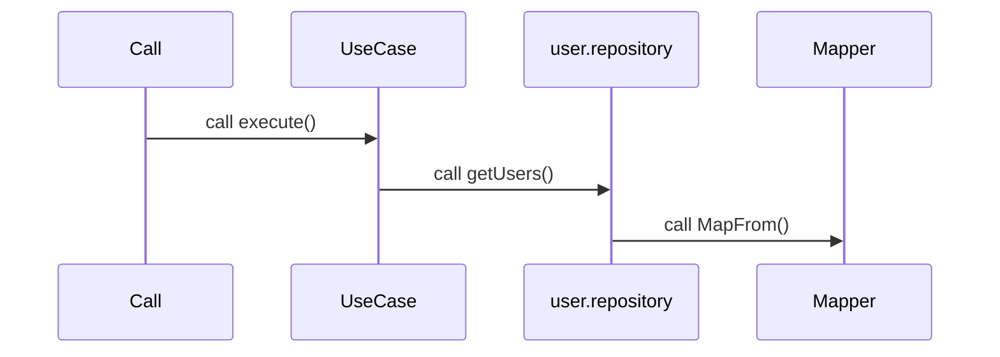

1) Component get dependency `domain/usecases/...usecase`
2) `...usecase` get dependency abstract `domain/usecases/use.repository`, inherit base `usecase`
3) `data/use.implimentation-repository` use mapper , inherit `use.repository`
s 